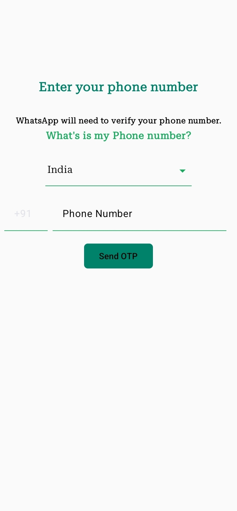
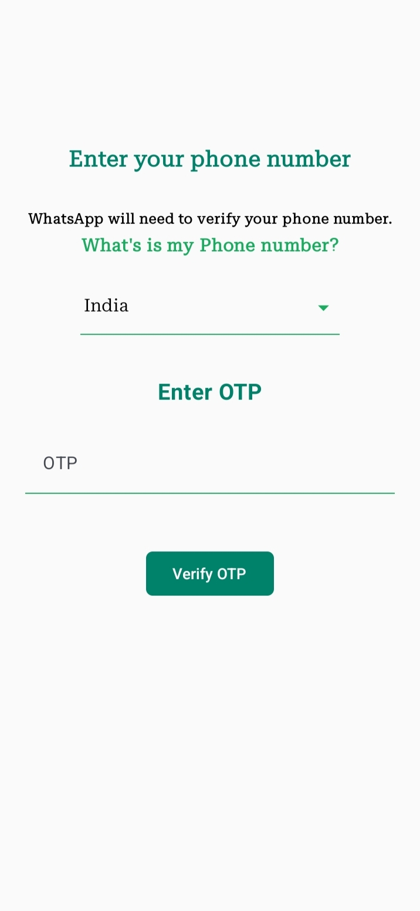
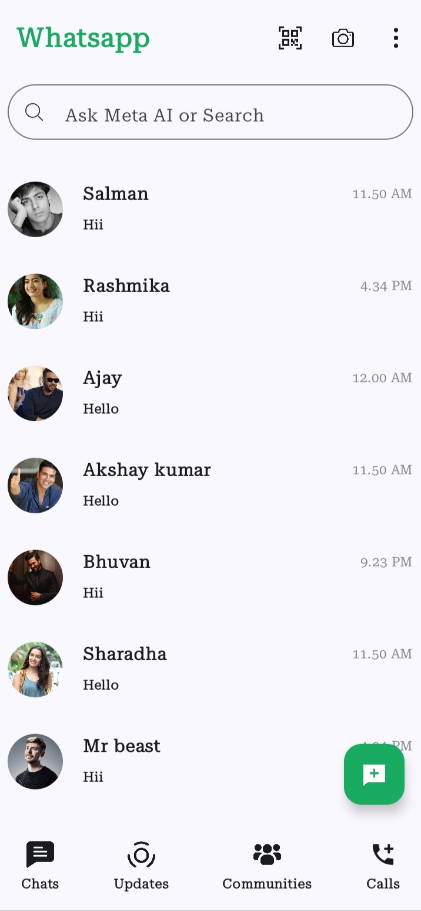
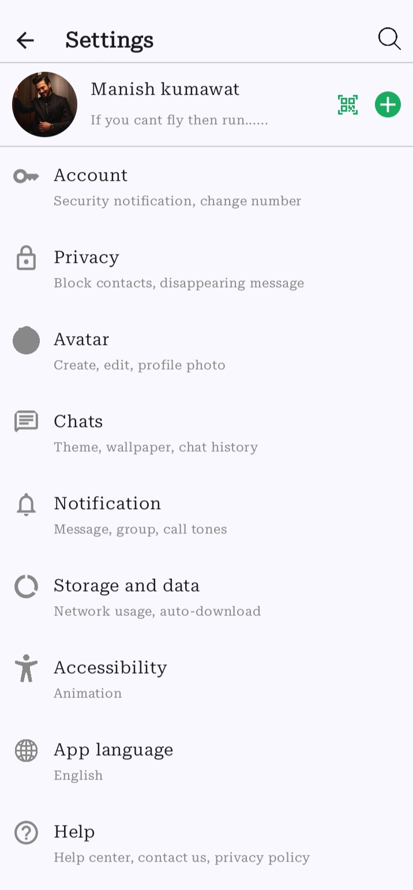
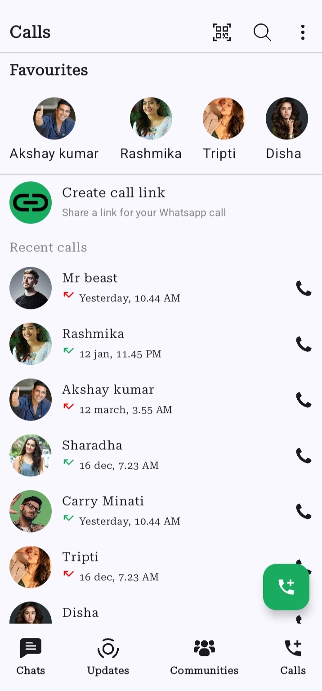
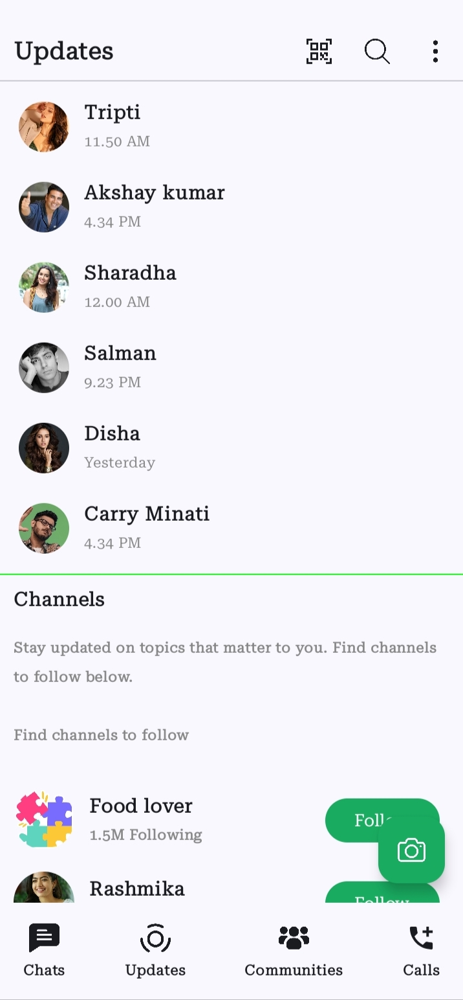

# WhatsApp Clone
A WhatsApp-inspired Android application built with Jetpack Compose and Firebase Authentication.
The project includes phone number authentication and demonstrates modern Android development practices. Chat data is currently implemented using dummy/static data for UI and navigation purposes.

# Features
- Phone Number Authentication
- OTP Verification
- Chat List Screen
- Chat Screen UI
- User Profile Screen
- Jetpack Compose
- Navigation Compose
- Material Design 3
- Firebase Authentication

# Tech Stack
- Kotlin
- Jetpack Compose
- Firebase Authentication
- Navigation Compose
- ViewModel
- Material 3

## 📱 Screenshots

| Mobile Number                          | OTP                            | Chat                            |
| ----------------------------- | ----------------------------------- | ----------------------------------- |
|  |  |  |

| Profile                             | Call                                                        | Update
| ----------------------------------- | ----------------------------------------- |  ----------------------------------------- | 
|  |  |  |

